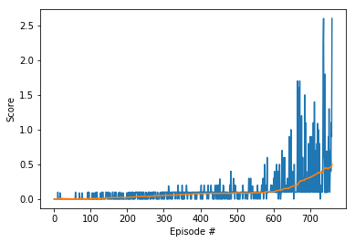

# Report: Project 3 - Collaboration and Competition

## Introduction 
In this project we implemented the [Multi-Agent Actor-Critic for Mixed Cooperative-Competitive Environments](https://arxiv.org/pdf/1706.02275.pdf) paper (Ryan Lowe, Yi Wu, et al)[1], that presents a variations of the [Deep Deterministic Policy Gradient](https://arxiv.org/pdf/1509.02971.pdf) (DDPG)[2] algorithm with an adaption for multi-agent environments, the algorithm is named [Multi-Agent Deep Deterministic Policy Gradient](https://arxiv.org/pdf/1706.02275.pdf) (MADDPG). 

The MADDPG implementation was used to solve the [Tennis environment](https://github.com/Unity-Technologies/ml-agents/blob/master/docs/Learning-Environment-Examples.md#tennis), an environment that provides two agent interacting in a continuous action spaces

## Solution

In the MADDPG model, each agent is treated as an “actor” which gets advice from a “critic” that helps the actor decide what actions to reinforce during training. To goal of the critic is to try to predict the value(i.e. the reward we expect to get in the future) of an action in a particular state, which is used by the agent — the actor — to update its policy. By using predictions of future rewards, MADDPG injects some stability over time compared to traditional reinforcement learning methods as the actual rewards can vary considerably in multi-agent environments. To make it feasible to train multiple agents that can act in a globally-coordinated way, MADDPG allow critics to access the observations and actions of all the agents. The following diagram illustrates the basic constructs of the MADDPG model[3].

### Hyperparameters

The following hyperparameters were used:

  - Both actor and critic for each agent have two layer networks: 256 hidden units in the first layer, 128 in the second
  - Relu activation functions were used for both actor and critic models (hidden layers), tanh for the output layers (actor only)
  - Discount factor gamma of 0.99
  - Soft target update parameter tau of 6e-2
  - Replay buffer size of 1e6
  - Batch size of 128
  - Gradient upgrade was done on every step
  - Learning rate for both actor and critic were 1e-3
  - Epsilon start value of 5, decay factor was set to 0.997

MADDPG algorithm was able to solve the modified Unity Tennis environment in about 1000 episodes consistently. Here is the algorithms rewards(score) plot captured during the training episodes:

### Future Ideas
Some ideas to try in the future are:

  - Implement Multi Agent Proximal Policy Optimization (MAPPO) and compare to MADDPG. 
  - Implement Prioritized Experience Replay and to see how it affects agents learning. 

### References

[1][Multi-Agent Actor-Critic for Mixed Cooperative-Competitive Environments](https://arxiv.org/pdf/1706.02275.pdf) paper (Ryan Lowe, Yi Wu, et al)[1]

[2][Continuous Control with Deep Reinforcement Learning](https://arxiv.org/pdf/1509.02971.pdf) paper (Lillicrap et al)

[3][The Coopetition Dilemma: Building Reinforcement Learning Agents that Learn to Collaborate and Compete at the Same Time](https://towardsdatascience.com/the-coopetition-dilemma-building-reinforcement-learning-agents-that-learn-to-collaborate-and-84f2b2acb186)